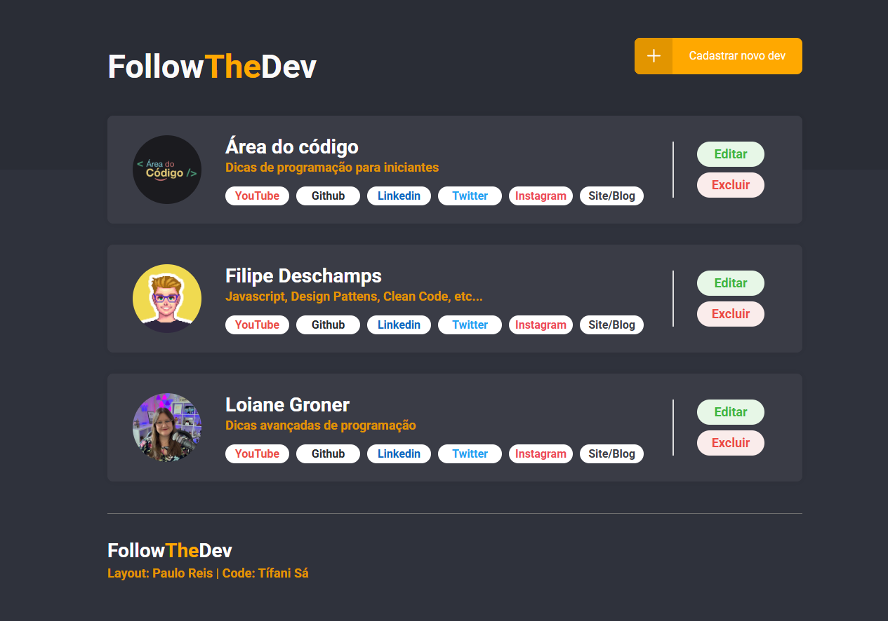

# 👨‍💻 FollowTheDev

**FollowTheDev** é uma página web simples desenvolvida com **HTML** e **CSS**, que lista e organiza canais de **YouTubers da área de programação**. Ideal para quem está começando ou quer descobrir novos criadores de conteúdo tech!

---

## 🧠 Funcionalidade

- Lista de canais com nome, imagem e descrição
- Design limpo
- Foco em criadores da área de tecnologia e desenvolvimento

---

## 📷 Preview

---

## 🛠️ Tecnologias

- HTML5
- CSS3 (com uso de Flexbox e estilização customizada)

---

